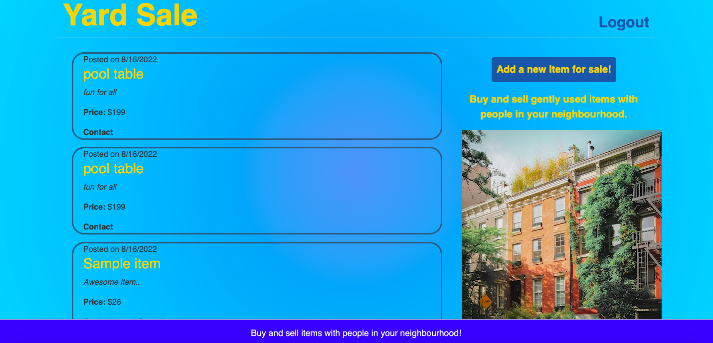

# Yard-Sale

A platform for neighbourhood residents to buy and sell everyday items. This will not only provide a medium for transaction but also build a sense of community and bring everyone closer.

  ## Licensing:
  

  ## Table of Contents 
  - [Description](#description)
  - [Installation](#installation)
  - [Usage](#usage)
  - [Contribution](#contribution)
  - [Testing](#testing)
  - [Additional Info](#additional-info)

  ## Description:
  A simple but effective platform for neighbourhood community members to buy/sell everyday household items. Good way to get rid of unwanted stuff and cash out, meet and greet community members and great way to have fun. Application has a clean UI, is hosted on heroku server with data. Users can sign up and securely read/create items for sale.
  
  ## Sample Screenshots:
  
  

  ## Installation:
  App uses NODE.JS, EXPRESS.JS, MYSQL, Sequelize ORM, Vivus, Bcrypt, DotEnv, Express-Session, Express-Handlebars etc. or just do 'npm i' through the command line to install the necessary packages. 
  App also deployed to Heroku: https://yard-5ale.herokuapp.com/

  ## Usage:
  'npm start' or 'node server'
  deployed app: https://yard-5ale.herokuapp.com/

  ## License:
  None

  ## Contribution:
  Contributions done by:
    - [neetsabharwal](https://github.com/neetsabharwal)
    - [RHunjan](https://github.com/RHunjan)
    - [AlexxSavov](https://github.com/AlexxSavov)

  ## Testing:
  Tested thoroughly in develompment environment.
  
  ## Additional Info:
  N/A
